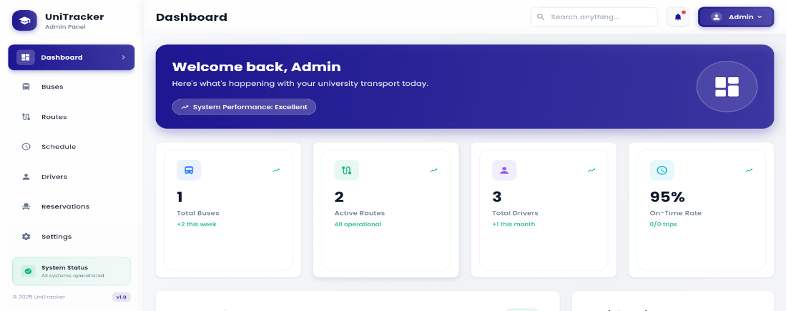
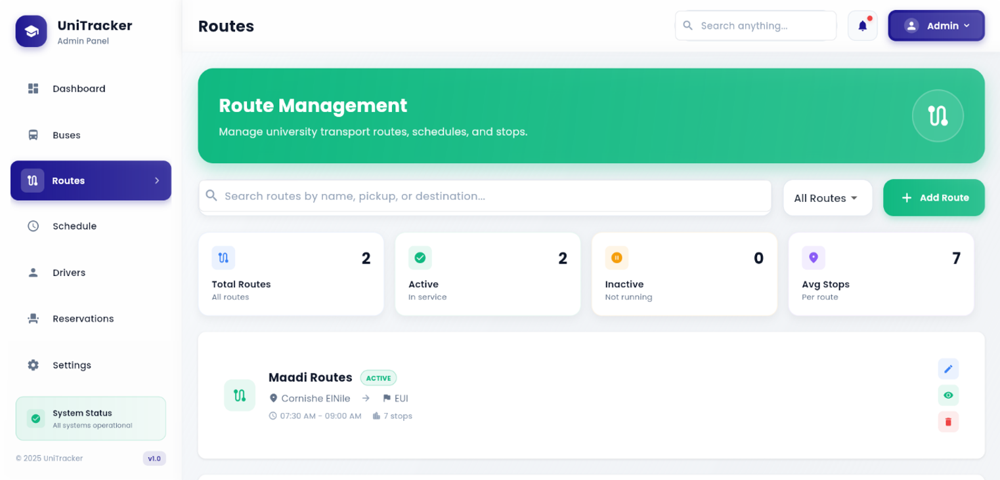

# UniTracker - Smart University Transportation Management System

Welcome to the official repository for **UniTracker**, a comprehensive university transportation management platform designed to modernize and optimize campus shuttle services. This was developed as our graduation project for the Faculty of Business Informatics at Egypt University of Informatics.

## 🚀 The Problem

University transportation systems often suffer from a lack of real-time bus schedules, overcrowding, inefficient routes, and general student dissatisfaction. UniTracker was built to solve these problems through a mobile-first, data-driven solution that benefits both students and university administrators.

## ✨ Key Features

UniTracker is packed with features to create a seamless and efficient transportation experience:
*    **For Students & Staff (Mobile App):**
      *    🗺️ **Live GPS Bus Tracking:** See your bus's real-time location on a map and get accurate arrival time estimates.
      *   🎟️ **Seat Reservation:** Book your seat in advance to guarantee your spot and avoid overcrowded buses.
      *   🗓️ **Dynamic Schedules:** Access up-to-date bus routes, stops, and timetables.
      *   🔔 **Real-Time Notifications:** Receive alerts for delays, schedule changes, or when your bus is approaching.
      *   👤 **Personalized Profiles:** Manage your bookings, favorite routes, and personal information.

*    **For University Admins (Web App):**
      *   📊 **Fleet & Route Management:** Easily add, remove, or modify bus routes and schedules.
      *   📈 **Ridership Analytics:** Monitor passenger counts and usage data to optimize bus allocation and reduce costs.
      *   🪪 **Driver Management:** Oversee driver profiles, assignments, and performance statistics.
      *   📢 **System-Wide Alerts:** Communicate important updates or changes to all users.

## 🛠️ Technology Stack

We chose a modern and efficient technology stack to build UniTracker:

*   **Frontend (Mobile App):**
    *   
    *   
*   **Backend:**
    *   
    *   
*   **APIs & Services:**
    *   **Google Maps API:** For all geolocation and live mapping features.
    *   **OneSignal:** For push notifications and alerts.
*   **Design & Prototyping:**
    *   

 ## 🎨 Screenshots

***Note: To add your images, create an `images` folder in your repository, upload your screenshots to it, and then replace the paths below.***

| Student App - Home | Student App - Schedules | Admin Dashboard |
| :----------------: | :---------------------: | :---------------: |
|    |  |     |
|   **Driver App**   |   **Student Profile**   | **Route Management** |
|      |      |  |

## 👥 Our Team

This project was brought to life by a dedicated team of students. We collaborated on all phases of the project, from conception and design to development and testing.

*   **Jana Ahmed** - [LinkedIn Profile](https://github.com/your-username)
*   **Maya Yakout** - [LinkedIn Profile](https://github.com/your-username)
*   **Nouran Ahmed** - [LinkedIn Profile](https://github.com/your-username)
*   **Christine Nagy** - [LinkedIn Profile](https://github.com/your-username)
*   **Zeina Sherif** - [LinkedIn Profile](https://github.com/your-username)

## 📜 Project Documentation

This repository contains the complete graduation project documentation [`UniTracker-Capstone-Project.pdf`](UniTracker-Capstone-Project.pdf), which includes:
*   In-depth Project Proposal & Feasibility Study
*   System Analysis & Design (DFDs, Use Cases, ERDs)
*   UML Class Diagrams & Storyboards
*   Full UI Manual and more.

## 🙏 Acknowledgements

*   We extend our heartfelt appreciation to our esteemed supervisor, **Dr. Anas Ismail**, for his continuous support and insightful feedback.
*   This project is also lovingly dedicated to the memory of **Prof. Reem Bahgat**, the Founding President of EUI, whose visionary leadership continues to inspire us.
